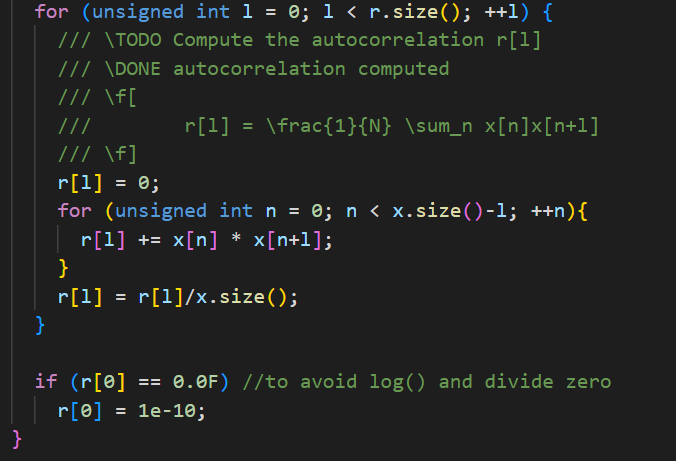
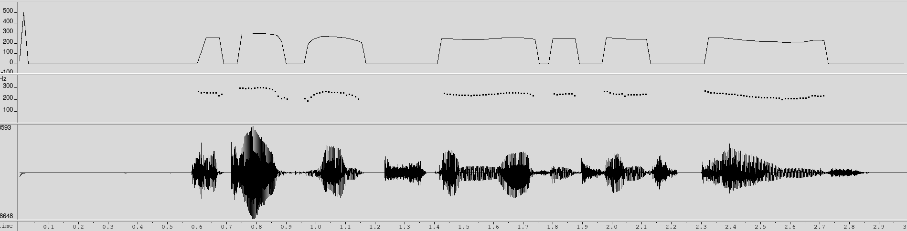

PAV - P3: estimación de pitch
=============================

Esta práctica se distribuye a través del repositorio GitHub [Práctica 3](https://github.com/albino-pav/P3).
Siga las instrucciones de la [Práctica 2](https://github.com/albino-pav/P2) para realizar un `fork` de la
misma y distribuir copias locales (*clones*) del mismo a los distintos integrantes del grupo de prácticas.

Recuerde realizar el *pull request* al repositorio original una vez completada la práctica.

Ejercicios básicos
------------------

- Complete el código de los ficheros necesarios para realizar la estimación de pitch usando el programa
  `get_pitch`.

   * Complete el cálculo de la autocorrelación e inserte a continuación el código correspondiente.

   

   * Inserte una gŕafica donde, en un *subplot*, se vea con claridad la señal temporal de un segmento de
     unos 30 ms de un fonema sonoro y su periodo de pitch; y, en otro *subplot*, se vea con claridad la
	 autocorrelación de la señal y la posición del primer máximo secundario.

	 NOTA: es más que probable que tenga que usar Python, Octave/MATLAB u otro programa semejante para
	 hacerlo. Se valorará la utilización de la biblioteca matplotlib de Python.

   Para hacer esta gráfica hemos usado el código en Python:
        import numpy as np
        import matplotlib
        matplotlib.use('TkAgg')
        import matplotlib.pyplot as plt
        import soundfile as sf

        signal, fm = sf.read('rl002.wav') # Usamos señal rl002
        t = np.arange(0, len(signal)) / fm 

        t_ms = 30                 # 30 ms
        l = int((fm * t_ms)/1e3)  # 'l' muestras

        def autocorrelacion(vector):
            autocorrelation = np.correlate(vector, vector, mode = 'full')
            return autocorrelation[autocorrelation.size//2:]

          # Create a figure with a 2x2 grid of subplots
        fig, axs = plt.subplots(2, 2, figsize=(10, 6))

          # Plot the complete signal in the top-left subplot
        axs[0, 0].plot(t, signal)
        axs[0, 0].set_title('Señal completa (rl002)', fontweight='bold')
        axs[0, 0].set_xlabel('s', fontsize=10)
        axs[0, 0].set_ylabel('Amplitud', fontsize=10)

          # Plot the 30ms signal segment in the top-right subplot
        axs[0, 1].plot(t[fm:fm+l], signal[fm:fm+l])
        axs[0, 1].set_title('Señal recortada (30ms)', fontweight='bold')
        axs[0, 1].set_xlabel('Muestras', fontsize=10)
        axs[0, 1].set_ylabel('Amplitud', fontsize=10)

          # Plot the autocorrelation in the bottom-left subplot
        axs[1, 0].plot(t[:l]*1000, autocorrelacion(signal[fm:fm+l]))
        axs[1, 0].set_title('Autocorrelación', fontweight='bold')
        axs[1, 0].set_xlabel('n', fontsize=10)
        axs[1, 0].set_ylabel('Amplitud', fontsize=10)

          # Remove the bottom-right subplot
        fig.delaxes(axs[1, 1])

          # Adjust the spacing between the subplots
        fig.subplots_adjust(hspace=0.4, wspace=0.3)

          # Display the figure
        plt.show()

   

   * Determine el mejor candidato para el periodo de pitch localizando el primer máximo secundario de la
     autocorrelación. Inserte a continuación el código correspondiente.

    Para calcular el pitch necesitamos encontrar la posición del primer máximo secundario de la autocorrelación. Para ello, vamos a utilizar la distancia entre el máximo principal y el siguiente, llamada lag.
    Si trabajamos con una trama sorda, no podremos encontrar el pitch y nos devuelve un 0, mientras que si la trama es sonora, nos va a devolver su pitch en Hz.

    El código para calcular el pitch es el siguiente:
        float PitchAnalyzer::compute_pitch(vector<float> & x) const {
            if (x.size() != frameLen)
              return -1.0F;

            // center-clipping
            float max = *std::max_element(x.begin(), x.end());
            for(int i = 0; i < (int)x.size(); i++) {
              if(abs(x[i]) < 0.0048) {
                x[i] = 0.0F;
              }
            }
            //Frame normalization
            for (int i = 0; i < (int)x.size(); i++)
              x[i] /= max;

            //Window input frame
            for (unsigned int i=0; i<x.size(); ++i)
              x[i] *= window[i];

            vector<float> r(npitch_max);

            //Compute correlation
            autocorrelation(x, r);

            vector<float>::const_iterator iR = r.begin(), iRMax = iR+ npitch_min;

            for(iR = r.begin()+npitch_min; iR< r.begin()+npitch_max;iR++){
                if(*iR>*iRMax){
                  iRMax = iR;
                }     
            }

            /// \TODO 
          /// Find the lag of the maximum value of the autocorrelation away from the origin. 
          /// Choices to set the minimum value of the lag are:
          ///    - The first negative value of the autocorrelation.
          ///    - The lag corresponding to the maximum value of the pitch.
            ///	   .
          /// In either case, the lag should not exceed that of the minimum value of the pitch.
          /// \DONE

            unsigned int lag = iRMax - r.begin();

            float pot = 10 * log10(r[0]);

            //You can print these (and other) features, look at them using wavesurfer
            //Based on that, implement a rule for unvoiced
            //change to #if 1 and compile
        #if 1
            if (r[0] > 0.0F)
              cout << pot << '\t' << r[1]/r[0] << '\t' << r[lag]/r[0] << endl;
        #endif
            fprintf(r1 , "%f \n", r[1]/r[0]);
            fprintf(rmax , "%f \n", r[lag]/r[0]);
            fprintf(potf , "%f \n", pot);

            if (unvoiced(pot, r[1]/r[0], r[lag]/r[0]))
              return 0;
            else{ 
              return (float) samplingFreq/(float) lag;
            }
            
          }

   * Implemente la regla de decisión sonoro o sordo e inserte el código correspondiente.
      bool PitchAnalyzer::unvoiced(float pot, float r1norm, float rmaxnorm) const {
    /// \TODO Implement a rule to decide whether the sound is voiced or not.
    /// * You can use the standard features (pot, r1norm, rmaxnorm),
    ///   or compute and use other ones.
    /// \DONE
    if((rmaxnorm > 0.4 || r1norm > 1.5) && pot > -46 )
      return false;
    else
      return true;
  }

    Con estos parámetros, hemos obtenido los siguientes resultados ejecutando el programa con el audio de prueba:
    

   * Puede serle útil seguir las instrucciones contenidas en el documento adjunto `código.pdf`.

- Una vez completados los puntos anteriores, dispondrá de una primera versión del estimador de pitch. El 
  resto del trabajo consiste, básicamente, en obtener las mejores prestaciones posibles con él.

  * Utilice el programa `wavesurfer` para analizar las condiciones apropiadas para determinar si un
    segmento es sonoro o sordo. 
	
	  - Inserte una gráfica con la estimación de pitch incorporada a `wavesurfer` y, junto a ella, los 
	    principales candidatos para determinar la sonoridad de la voz: el nivel de potencia de la señal
		(r[0]), la autocorrelación normalizada de uno (r1norm = r[1] / r[0]) y el valor de la
		autocorrelación en su máximo secundario (rmaxnorm = r[lag] / r[0]).

    

    En esta gráfica están representados de arriba a abajo: potencia, r1nomr y rmaxnorm. Podemos observar que en los sonidos sonoros obtenemos valors más altos que en el caso de los sordos. A partir de estos valores, variamos nuestros umbrales para obtener un mejor resultado.

		Puede considerar, también, la conveniencia de usar la tasa de cruces por cero.

	    Recuerde configurar los paneles de datos para que el desplazamiento de ventana sea el adecuado, que
		en esta práctica es de 15 ms.

      - Use el estimador de pitch implementado en el programa `wavesurfer` en una señal de prueba y compare
	    su resultado con el obtenido por la mejor versión de su propio sistema.  Inserte una gráfica
		ilustrativa del resultado de ambos estimadores.

    

    Vemos que obtenemos unos valores muy similares a la versión del propio programa aunque tenemos algunos errores que podrían arreglarse con un filtro de mediana.
     
		Aunque puede usar el propio Wavesurfer para obtener la representación, se valorará
	 	el uso de alternativas de mayor calidad (particularmente Python).
  
  * Optimice los parámetros de su sistema de estimación de pitch e inserte una tabla con las tasas de error
    y el *score* TOTAL proporcionados por `pitch_evaluate` en la evaluación de la base de datos 
	`pitch_db/train`..

  A base de prueba y error, el mejor resultado que obtenemos es el siguiente:

  

Ejercicios de ampliación
------------------------

- Usando la librería `docopt_cpp`, modifique el fichero `get_pitch.cpp` para incorporar los parámetros del
  estimador a los argumentos de la línea de comandos.
  
  Esta técnica le resultará especialmente útil para optimizar los parámetros del estimador. Recuerde que
  una parte importante de la evaluación recaerá en el resultado obtenido en la estimación de pitch en la
  base de datos.

  * Inserte un *pantallazo* en el que se vea el mensaje de ayuda del programa y un ejemplo de utilización
    con los argumentos añadidos.

    

- Implemente las técnicas que considere oportunas para optimizar las prestaciones del sistema de estimación
  de pitch.

  Entre las posibles mejoras, puede escoger una o más de las siguientes:

  * Técnicas de preprocesado: filtrado paso bajo, diezmado, *center clipping*, etc.

  * Técnicas de postprocesado: filtro de mediana, *dynamic time warping*, etc.
  Hemos incorporado un filtro de mediana de orden 3 para ajustar valores atípicos que puedan surgir por errores en la estimación. Este filtro analiza cada muestra junto con sus vecinas inmediatas para determinar si su valor es consistente, permitiendo así mantener la integridad de los detalles de la señal.

  

  * Métodos alternativos a la autocorrelación: procesado cepstral, *average magnitude difference function*
    (AMDF), etc.
  * Optimización **demostrable** de los parámetros que gobiernan el estimador, en concreto, de los que
    gobiernan la decisión sonoro/sordo.
  * Cualquier otra técnica que se le pueda ocurrir o encuentre en la literatura.
  

  Encontrará más información acerca de estas técnicas en las [Transparencias del Curso](https://atenea.upc.edu/pluginfile.php/2908770/mod_resource/content/3/2b_PS%20Techniques.pdf)
  y en [Spoken Language Processing](https://discovery.upc.edu/iii/encore/record/C__Rb1233593?lang=cat).
  También encontrará más información en los anexos del enunciado de esta práctica.

  Incluya, a continuación, una explicación de las técnicas incorporadas al estimador. Se valorará la
  inclusión de gráficas, tablas, código o cualquier otra cosa que ayude a comprender el trabajo realizado.

  También se valorará la realización de un estudio de los parámetros involucrados. Por ejemplo, si se opta
  por implementar el filtro de mediana, se valorará el análisis de los resultados obtenidos en función de
  la longitud del filtro.
   

Evaluación *ciega* del estimador
-------------------------------

Antes de realizar el *pull request* debe asegurarse de que su repositorio contiene los ficheros necesarios
para compilar los programas correctamente ejecutando `make release`.

Con los ejecutables construidos de esta manera, los profesores de la asignatura procederán a evaluar el
estimador con la parte de test de la base de datos (desconocida para los alumnos). Una parte importante de
la nota de la práctica recaerá en el resultado de esta evaluación.
